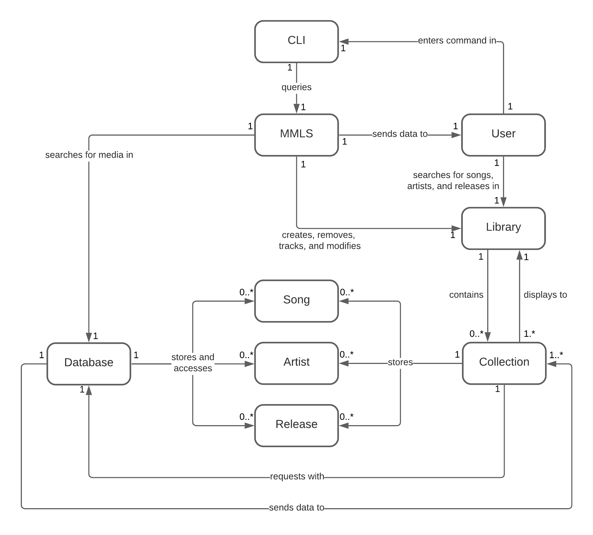

# The Muze Music Library System - Release 1

#### Prepared by Team 4

| Name | Email |
| ---- | ----- |
| Brandon Montijo | bcm8504@rit.edu |
| Nikhil Raina | nxr5013@rit.edu |
| Alex Tackett | ajt6798@rit.edu |
| Chase Marino | cam4555@rit.edu |
| Qunzhan Huang | qxh2404@rit.edu |

## Summary

The Muze Music Library System (MMLS) provides an application for music aficionados to track songs in their respective
collection. Users can peruse the database via a command line interface for songs by title, artist, or album. They have
the ability to create multiple collections in their music library. Each collection allows them to add songs or remove
them from there. They can also optionally rate individual songs on a 1-5 star basis. Users have the option to search
through the database and library by entering the song title, artist or the album. They can also list their collection
by title, artist, or album alphanumerically. 

Key system responsibilities are as follows: 

1. The system provides an interface where users can enter basic single-line requests. Requests are handled and provided
with a textual response. If needed, users can list all command possibilities using a help request. 
2. The system provides a searchable database of all available music passed by the csv files. It responds to queries sent
by the user based on what information the user requests for: whether it be artist, song, or release. 
3. The system tracks and persists the user’s personal library. It allows users to add songs or releases to their
collection based on specific queries. 

## Domain Model

## System Architecture

## Subsystems

## Status of Implementation

## Appendix